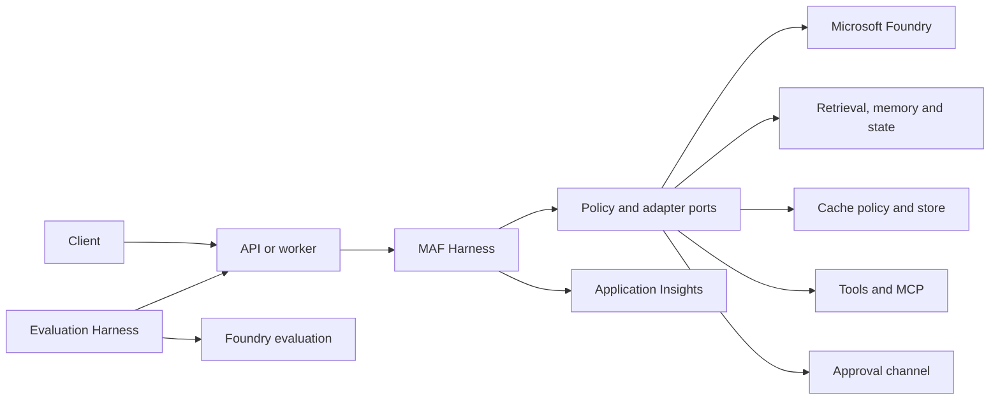

# AI Agent Harness

A cloneable code template for creating governed, observable and evaluable AI agents on Azure. Users configure the template, replace the sample tools and domain instructions, run the Agent Harness including companion Evaluation, and deploy it into their own Azure tenant.

Version 1.0 is cloud-first. The Agent Harness runs in the customer's Azure tenant, using the released Python Microsoft Agent Framework (MAF) Harness and Microsoft Foundry for models and evaluation. Replaceable concerns such as retrieval, context policy, memory, durable state, approvals and telemetry are exposed through typed contracts and validated configuration.

> Status: architecture and implementation plan are defined. Runtime code and infrastructure are not yet scaffolded.

## Scope

This repository is focused only on producing reusable implementation for the Agent Harness code template.

### In Scope

- A runnable MAF-based Agent Harness reference implementation.
- 3 type of profiles: Assistant, grounded-assistant and action-agent configuration profiles.
- Typed extension contracts for model clients, retrieval and chunking, context policy, memory, durable state, approvals, tools, audit and telemetry.
- Configurable caching for model prompts, immutable retrieval artifacts and safe tool results, with scoped keys, TTL, invalidation, telemetry and cost metrics.
- Mandatory governance controls for bounded execution, tool allow-listing, identity scope, approvals, idempotency and append-only audit events.
- A companion Evaluation Harness with versioned datasets, deterministic and Foundry evaluators, baseline comparison and release thresholds.
- Lightweight local test adapters and Azure reference adapters.
- Automated unit, policy, contract, integration, evaluation and deployment smoke tests.
- Repeatable Azure deployment through both `azd up` and a one-click **Deploy to Azure** button, backed by the same Bicep and passwordless identity.
- Technical documentation required to clone, configure, extend, test, deploy and operate the template.

### Out of Scope

- A new evaluation or observability platform; the template integrates released Foundry and Azure Monitor capabilities.
- Experimental multi-agent orchestration and AgentOps integration on the v1.0 critical path (backlog). Semantic response caching is supported through the cache-policy contract.

## Design Principles

- Compose released MAF Harness capabilities instead of reimplementing the agent loop.
- Keep policy separate from mechanism: configuration selects registered implementations and thresholds but cannot bypass mandatory controls.
- Treat retrieved content and tool output as untrusted data.
- Scope state, memory and cached artifacts by tenant and user.
- Keep business payloads out of telemetry by default.
- Add another framework only through an adapter that passes the shared conformance tests.

## Architecture



See [docs/reference-architecture.md](docs/reference-architecture.md) for runtime flow, extension ports, deployment topologies, and mandatory controls.

The Evaluation Harness is a companion test and monitoring layer. It invokes the same supported application entry point used in production; it does not run inside every live request.

## v1.0 Profiles

A profile is a validated configuration preset for a common agent use case. Customers select the profile that most closely matches the agent they want to build, then configure its model, tools, data sources and policy limits. Profiles use the same MAF Harness runtime and mandatory governance controls; they are not separate frameworks or applications.

| Select this profile | When the agent needs to | Controls added by the profile |
|---|---|---|
| Assistant | Answer questions and perform bounded tasks with approved tools | Typed tools, context budget, audit and telemetry |
| Grounded assistant | Produce evidence-based answers from customer data | Retrieval, citations, source freshness and an answerability gate |
| Action agent | Propose or execute changes in an external system | Durable checkpoints, human approval and idempotency protection |

To implement an agent from the template:

1. Select one profile as the starting configuration.
2. Register the customer's approved model, tools, data sources and storage adapters.
3. Configure profile limits and policies without disabling mandatory controls.
4. Run the profile's contract and evaluation tests before deployment.

A customer can deploy more than one agent (profile) from the template. Each deployed agent has its own profile and tenant-scoped configuration; for example, a grounded support assistant and a separate approval-gated action agent.

## Development Environments

| Environment | What runs there |
|---|---|
| Azure Dev | Agent Harness/API, Foundry model inference and evaluation, Application Insights, retrieval, persistent state, cache and deployed tools |
| Local | Source editing, unit/schema/policy tests, in-memory adapters and optional debugging against Azure Dev |

Azure Dev is the supported daily development and integration environment, deployed with `azd up` or the **Deploy to Azure** button. Local execution is a fast test path, not the reference hosting topology, and does not host model inference.

### Environment Requirements

These requirements are provisional and will be pinned as the template is implemented:

- An Azure subscription and permission to create resource groups, deploy resources and assign required RBAC roles.
- A Microsoft Entra user identity; committed secrets and shared credentials are not supported.
- Access to a supported Azure region with sufficient Microsoft Foundry model quota and capacity.
- Required Azure resource providers registered in the target subscription.
- Visual Studio Code with the Python, Bicep and Foundry Toolkit extensions.
- For `azd up`: Git, a supported Python version, the current supported Azure Developer CLI and required azd extensions.
- For **Deploy to Azure**: access to the Azure portal and permission to deploy the generated ARM template.
- For local tests: Git, Python and the repository's package manager; Azure access is not required for deterministic tests.
- Network access to Microsoft Foundry, Azure management and any configured data or tool endpoints.

## Planned Repository Layout

```text
src/
  core/                 # Policy models, ports, events
  adapters/
    maf/                # Reference runtime adapter
    foundry/            # Model, hosting, eval and tracing
    storage/            # Memory, state, artifact and audit stores
  app/                  # API/worker and composition root
config/                 # Versioned schemas and profiles
evals/                  # Datasets, evaluators and thresholds
infra/                  # azure.yaml and Bicep
tests/                  # Unit, contract, policy and smoke tests
docs/                   # Architecture, ADRs, plans and runbooks
```

Folders will be created with their first working artifact rather than as empty scaffolding.

## Template Deliverables

A tagged release is expected to contain:

1. Cloud-hosted Agent Harness in the user's Azure tenant, using a Foundry model deployment and sample read and approval-gated action tools.
2. Companion Evaluation Harness with seed smoke and regression datasets.
3. Validated configuration schemas and environment-safe example profiles.
4. In-memory development adapters and Azure reference adapters.
5. Policy, adapter-conformance, evaluation and deployment tests.
6. `azure.yaml`, modular Bicep and a **Deploy to Azure** button for equivalent CLI and one-click deployment paths.
7. Quickstart, extension, security, operations and troubleshooting documentation.

## Documentation

- [Engineering review](docs/blueprint-review.md)
- [Reference architecture](docs/reference-architecture.md)
- [Implementation plan](docs/implementation-plan.md)
- [Pattern catalogue](docs/pattern-catalog.md)
- [ADR 0001: MAF reference runtime](docs/decisions/0001-maf-reference-runtime.md)
- [ADR 0002: Cloud-first v1.0 development](docs/decisions/0002-cloud-first-v1-development.md)
- [ADR 0003: Dual Azure deployment entry points](docs/decisions/0003-dual-azure-deployment-entry-points.md)
- [Source blueprint](docs/source-blueprint.md)
- [Repository agent instructions](AGENTS.md)

## Delivery Path

1. Define the configuration, event, and adapter contracts.
2. Deploy a cloud-hosted MAF Harness walking skeleton to Azure Dev.
3. Add grounded retrieval, context controls, and answerability routing.
4. Add Foundry and Azure persistence adapters.
5. Add dual service-health and outcome-quality monitoring.
6. Add Foundry evaluation gates and red-team evidence.
7. Validate `azd up` and **Deploy to Azure** against the same Bicep, parameters, RBAC, outputs and smoke tests.
8. Publish a versioned template release with clean-clone validation evidence.

Version 1.0 supports two Azure deployment entry points: `azd up` for developers and **Deploy to Azure** for portal-based one-click deployment. Both deploy the same Bicep and must produce equivalent resources, RBAC, outputs and post-deployment validation.


## Source References

- [MAF Agent Harness](https://learn.microsoft.com/agent-framework/concepts/harness)
- [MAF getting started](https://learn.microsoft.com/agent-framework/get-started/)
- [Microsoft Foundry samples](https://github.com/microsoft-foundry/foundry-samples)