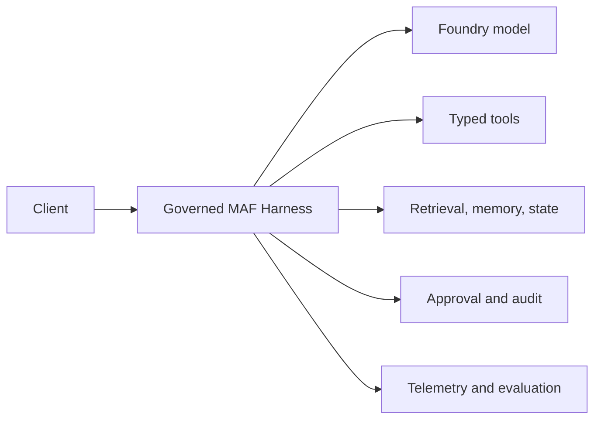

# AI Agent Harness

A reusable template for building governed, observable, and evaluable AI agents in a customer's
Azure tenant. It composes Microsoft Agent Framework (MAF) Harness for execution and Microsoft
Foundry for models, evaluation, and tracing instead of creating another agent runtime.

> **Current status:** Phase 1C is complete with an approved live-test model exception. The governed
> MAF-to-Foundry CLI selected a registered tool with correlated model and tool traces; streaming
> conformance also passes. The proof used `gpt-5-mini` because reference-model quota was unavailable.
> Phase 1D is complete in Azure Dev: the released Responses HTTP host has deterministic conformance
> tests and a local socket smoke proof. Foundry-hosted version 7 serves 100% of production traffic
> and completed live governed tool requests with correlated HTTP, agent, model, and tool traces,
> including streaming. The live subscription-scope ARM deployment succeeded with outputs matching
> the azd environment, completing the two-path infrastructure parity proof.
> The guarded hosted entry point binds one deployment tenant with Foundry endpoint RBAC and
> request-scoped Foundry call-ID forwarding. Python 3.12 container packaging and registry
> infrastructure and metadata-only Application Insights export are available. Live checks reject
> unauthenticated forged headers and instruction overrides, and the platform denies (403) an
> in-tenant principal with no project role.
> Phase 2 has started with a local grounding slice: scoped retrieval with lexical relevance scoring,
> a Markdown corpus loader, source lineage, freshness, untrusted-content labeling, citations, safe
> answerability routes, deterministic chunk identity, bounded context plans and a grounded path
> that never calls the model on weak, stale, conflicting, malicious or out-of-scope evidence. It is
> runnable locally with `grounded-run` and covered by conformance tests; HTTP hosting, Azure AI
> Search and measured relevance quality remain subsequent work.

## Understand it in two minutes


```mermaid
flowchart LR
    CLIENT[Client] --> HARNESS[Governed MAF Harness]
    HARNESS --> MODEL[Foundry model]
    HARNESS --> TOOLS[Typed tools]
    HARNESS --> DATA[Retrieval, memory, state]
    HARNESS --> CONTROL[Approval and audit]
    HARNESS --> OBS[Telemetry and evaluation]
```

The harness keeps customer-editable configuration separate from mandatory controls. Configuration
may select registered models, tools, and adapters, but cannot disable identity scope, tool
validation, act-tier approval, idempotency, audit correlation, telemetry privacy, or execution
ceilings.

## What works today

- A pinned Python 3.12 and `uv` development environment.
- Versioned schemas for harness configuration and normalized run events.
- Assistant, grounded-assistant, and action-agent example profiles.
- Framework-neutral contracts for model, retrieval, context, memory, state, approval, tools, audit,
  and telemetry.
- A deterministic local CLI with a tenant-scoped read tool, code-owned registry, governance checks,
  and append-only in-memory audit.
- A proposal tool and approval-gated sample action with checkpoints, expiry, exact proposal binding,
  idempotency, and uncertain-outcome protection.
- Architecture decisions for MAF, Foundry, Cosmos DB, Azure AI Search, deployment, and the reference
  model.
- Deterministic schema and contract checks that require no Azure connection.

The deterministic local runners intentionally have no model or Azure dependency. The Phase 1C MAF
tests use a scripted model client, while the live path uses Foundry through environment-resolved
configuration. The deployable Azure Dev environment follows in Phase 1D.

## Quick start

Prerequisites: Git and [`uv` 0.11.15](https://docs.astral.sh/uv/).

```powershell
git clone https://github.com/arun13go/AI-Agent-Harness.git
Set-Location "AI-Agent-Harness"
uv sync --frozen
uv run pytest
uv run pyright
uv run ruff check .
```

Expected result: the test suite passes, type checking reports no errors, and linting succeeds.
Azure access is not required for these checks.

Run the Phase 1A local read path:

```powershell
uv run agent-harness run `
  --profile config\profiles\assistant.yaml `
  --tenant tenant-0001 `
  --subject subject-0001 `
  --service api
```

The result is labeled as untrusted tool output, while the four audit events record only identifiers,
decisions, and lifecycle metadata.

Run the Phase 1B approved action demo:

```powershell
uv run agent-harness action-demo `
  --profile config\profiles\action-agent.yaml `
  --tenant tenant-0001 `
  --subject subject-0001 `
  --approver approver-0001 `
  --decision approved
```

Use `--decision denied` to verify that no action effect occurs.

Run the Phase 1C live MAF and Foundry path after setting the non-secret environment references:

```powershell
$env:FOUNDRY_PROJECT_ENDPOINT = "https://<account>.services.ai.azure.com/api/projects/<project>"
$env:AZURE_AI_MODEL_DEPLOYMENT_NAME = "<deployment-name>"

uv run agent-harness agent-run `
  --profile config\profiles\assistant.yaml `
  --tenant tenant-0001 `
  --subject subject-0001 `
  --prompt "Check the API service status."
```

Authentication uses `DefaultAzureCredential`; do not place credentials, endpoints, deployment
names, tenant IDs, or subscription IDs in committed profiles.

Run the Phase 1D local HTTP host with the same Foundry environment variables:

```powershell
uv run python -m agent_harness.app.agent_http_server `
  --tenant local-tenant `
  --subject local-subject
```

It listens only on `127.0.0.1:8088`. This is a development identity, not cloud authentication.
Use `GET /readiness` for service health and `POST /responses` with
`{"input":"Check API status","stream":false}` for a stateless run. Instructions, caller-selected
tools, stored conversations, and background requests are rejected. For debugging, press **F5**
and choose **Harness: Agent HTTP server and Inspector** after setting the Foundry environment in
VS Code's process. Live Inspector compatibility is still pending validation; see the
[HTTP code tour](docs/getting-started/code-tour.md#phase-1d-http-path).

See [CONTRIBUTING.md](CONTRIBUTING.md) for the supported workflow and dependency-update policy.

For Foundry Hosted Agents container deployment, see the
[Azure Dev container guide](docs/getting-started/azure-dev.md). The template reuses an existing
Foundry project and model and provisions the registry prerequisites.

### Deploy to Azure

[](https://portal.azure.com/#create/Microsoft.Template/uri/https%3A%2F%2Fraw.githubusercontent.com%2Farun13go%2FAI-Agent-Harness%2Fmain%2Finfra%2Fmain.json)

The button deploys [`infra/main.json`](infra/main.json), generated from the same Bicep that `azd`
uses, at subscription scope. It needs an existing Foundry account, project and model deployment.
It provisions infrastructure only; registering the agent is the shared step in the
[Azure Dev guide](docs/getting-started/azure-dev.md#register-the-hosted-agent-both-entry-points)
([ADR 0016](docs/decisions/0016-registration-outside-deployment-scripts.md)). The button follows
`main`; fork the repository and change the encoded URL to deploy a fork or a pinned commit.

## Profiles

A profile is a policy preset, not a separate executable. The current CLI supports these explicit
profile and command pairings:

| Profile | Current command | Status |
|---|---|---|
| Assistant | `run` | Deterministic read path; no Azure required |
| Assistant | `agent-run` | Live MAF and Foundry read path |
| Grounded assistant (local profile) | `grounded-run` | Answers only from a local Markdown corpus; needs a Foundry model for the answer route |
| Grounded assistant (Azure profile) | None yet | Waits for the Azure AI Search adapter |
| Action agent | `action-demo` | Deterministic proposal, approval, and one-time action path |

Unsupported pairings fail explicitly. The grounded profile cannot silently run without its
required retrieval and answerability controls.

Run a grounded question against a folder of Markdown files, with the Foundry environment set as
above. The model is called only when enough relevant, in-scope evidence is found; otherwise the
command abstains and says so ([ADR 0020](docs/decisions/0020-local-lexical-retrieval-and-corpus-loading.md)):

```powershell
uv run agent-harness grounded-run `
  --profile config\profiles\grounded-assistant-local.yaml `
  --tenant tenant-0001 `
  --subject subject-0001 `
  --corpus docs\decisions `
  --question "Why is the tenant part of the chunk identifier?"
```

The output names the route, the answer, and the cited source files, and never echoes document
text. Matching is lexical and deliberately conservative, so a paraphrase that shares few words with
the text may abstain; use `--minimum-score` to adjust.

Examples live under [`config/profiles/`](config/profiles/).

## Repository map

| Path | Purpose |
|---|---|
| [`src/agent_harness/core/`](src/agent_harness/core/) | Framework-neutral types and adapter contracts |
| [`src/agent_harness/adapters/`](src/agent_harness/adapters/) | Local storage and typed tool implementations |
| [`src/agent_harness/app/`](src/agent_harness/app/) | Local runner and CLI composition |
| [`config/`](config/) | Versioned schemas and safe example profiles |
| [`tests/`](tests/) | Deterministic schema and contract checks |
| [`docs/`](docs/) | Human documentation, decisions, delivery plan, and historical context |
| [`AGENTS.md`](AGENTS.md) | Always-on instructions for AI coding agents, not human onboarding |

Folders for evaluations and infrastructure are created only when their first working artifacts are
added.

## Where to go next

- **New to the repository:** follow the [documentation reading paths](docs/README.md).
- **New to the code:** follow the [developer code tour](docs/getting-started/code-tour.md).
- **Preparing a contribution:** read [CONTRIBUTING.md](CONTRIBUTING.md).
- **Understanding the design:** read the
  [reference architecture](docs/architecture/overview.md).
- **Checking current and next work:** read the
  [implementation plan](docs/delivery/implementation-plan.md).
- **Reviewing decisions:** browse the [ADRs](docs/decisions/).

The completed Phase 1C runtime path is:

```text
released MAF Harness
  -> Foundry model adapter
  -> registered tool selection
  -> existing read and action policy
  -> correlated model and tool spans
```

The live proof on 16 October 2026 selected `get_service_status`, returned the sample API status, and
emitted six audit events with correlated model and tool spans. It used the approved `gpt-5-mini`
exception; reference-model validation remains quota-blocked. Phase 1D now has a tested local HTTP
boundary and Inspector launch wiring. Next: add verified Foundry-hosted identity and repeatable
Azure deployment, then collect live Inspector and cloud trace evidence.

## Product boundary

Version 1.0 is cloud-first and Python-based. Azure Dev is the reference integration environment.
Local development supports editing and deterministic tests; it does not host model inference.
Foundry-specific behavior stays behind explicit adapters, and another runtime or provider must pass
the shared contracts rather than claiming configuration-only compatibility.

For scope details and authoritative architecture rules, use the
[documentation index](docs/README.md).

## License

This project is licensed under the [MIT License](LICENSE).
