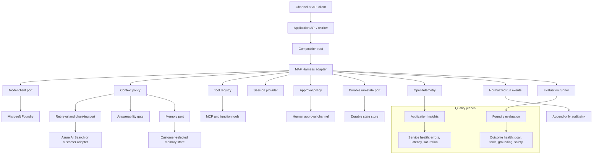

# Reference Architecture

## Design Intent

The repository is a governed application template, not a new agent framework. It uses MAF Harness as the first runtime and keeps customer-changeable concerns behind typed ports. Foundry is the reference Azure platform for models, hosted execution, evaluation, and tracing.



## Runtime Flow

1. Authenticate the caller and establish tenant, user, run, and maximum permission tier.
2. Load validated policy and select registered adapters in the composition root.
3. Build a MAF Harness agent with prompt layers, bounded tool invocation, context providers, approval behavior, and telemetry.
4. Retrieve only when needed. Label retrieved and tool-provided content as untrusted data.
5. For grounded answers, score answerability and route to answer, retrieve again, clarify, caveat, abstain, or escalate.
6. Before an act-tier tool, persist a proposal and checkpoint, request approval, then resume with an idempotency key.
7. Emit normalized audit and telemetry events at every state transition.
8. Evaluate both request-level outcomes and aggregate production trends.

## Portability Contract

The following ports are deliberately small. Their exact Python protocols are defined during implementation and protected by contract tests.

| Port | Required semantics | Reference implementation |
|---|---|---|
| Runtime adapter | Stream/run, session binding, cancellation, bounded steps, tool events | MAF Harness |
| Model client | Chat completion/response, usage metadata, error normalization | Foundry model deployment |
| Retrieval/chunking | Ingest, version, retrieve, citations, freshness metadata | Azure AI Search profile |
| Context policy | Budget, compaction, result handles, source labels | MAF providers plus template policy |
| Answerability | Evidence sufficiency and controlled route | Deterministic checks plus evaluator/model score |
| Memory | Scoped read/write/delete, provenance, TTL, policy gate | In-memory dev; customer-selected Azure store |
| Run state | Optimistic concurrency, checkpoint/resume, idempotency | In-memory dev; durable Azure store |
| Approval | Request, decision, expiry, identity, immutable reference | Console dev; customer workflow adapter |
| Audit | Append-only normalized events with correlation | Structured log plus durable sink |
| Evaluation | Dataset, target, metrics, thresholds, result artifact | Foundry evaluation |

Framework portability means a second runtime adapter can satisfy these semantics. It does not mean framework-specific behavior becomes identical.

## Configuration Model

Use versioned YAML validated by JSON Schema. Configuration selects only implementations registered by code.

```yaml
schemaVersion: 1
profile: grounded-assistant
runtime:
  adapter: maf
  maxSteps: 12
  timeoutSeconds: 120
model:
  provider: foundry
context:
  compaction: summarize
  maxInputTokens: 64000
retrieval:
  adapter: azure-ai-search
  chunking: structure-aware
answerability:
  enabled: true
  onInsufficientEvidence: clarify
memory:
  adapter: in-memory
  ttlDays: 30
state:
  adapter: in-memory
governance:
  maximumTier: propose
observability:
  exporter: application-insights
```

Secrets, endpoints resolved by azd, and tenant-specific IDs do not belong in committed configuration.

## Deployment Topologies

| Topology | Purpose | Characteristics |
|---|---|---|
| Azure Dev | Supported daily development and integration environment | Harness/API, managed identity, Foundry inference and evaluation, Application Insights, retrieval and Azure-backed state and cache; deployed by `azd up` or **Deploy to Azure** |
| Local | Fast test and optional debugging path | Source editing, deterministic tests and in-memory adapters; may connect to Azure Dev but does not host model inference |
| Enterprise | Customer production overlay | Private networking, customer stores, policy assignments, central monitoring, CI federation, landing-zone integration |

The repository deploys Azure Dev as the v1.0 reference topology. `azd up` consumes the canonical Bicep directly; **Deploy to Azure** consumes its generated ARM artifact. CI validates parity. The repository documents enterprise integration points without claiming to deploy the customer's landing zone.

## Mandatory Controls

These are code-enforced and cannot be disabled by normal profile configuration: identity scope, tool schema validation, allow-list enforcement, act-tier approval, idempotency, audit correlation, sensitive-data telemetry defaults, context source labeling, and hard execution ceilings.
